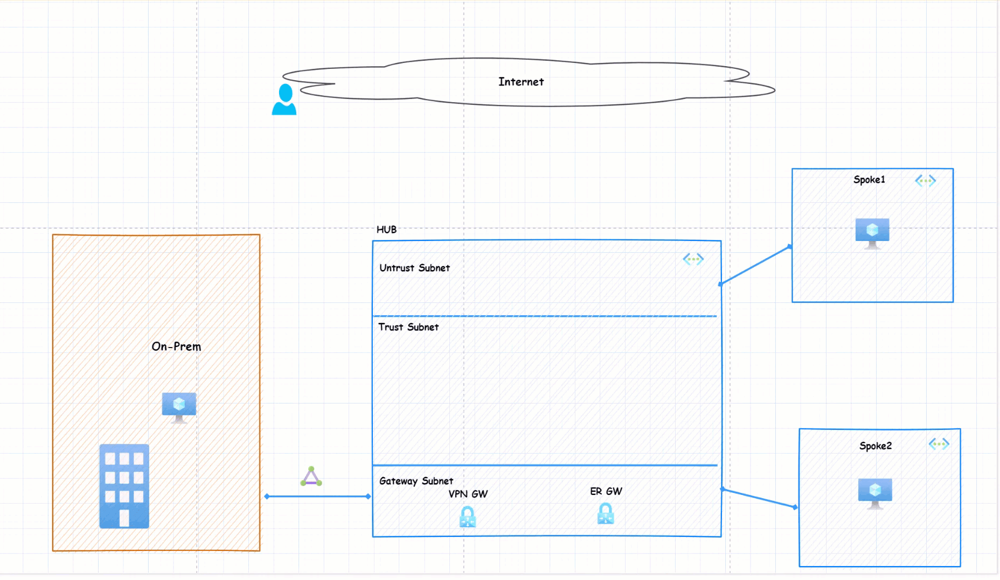
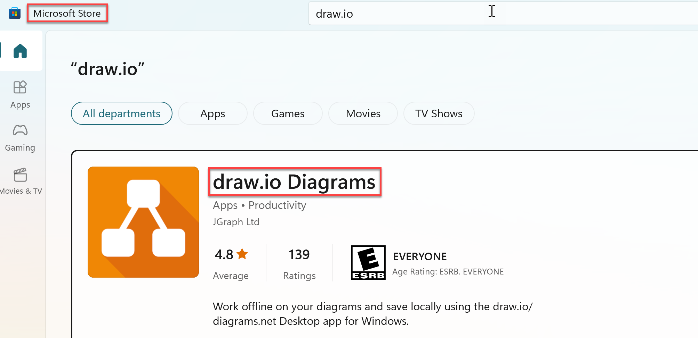
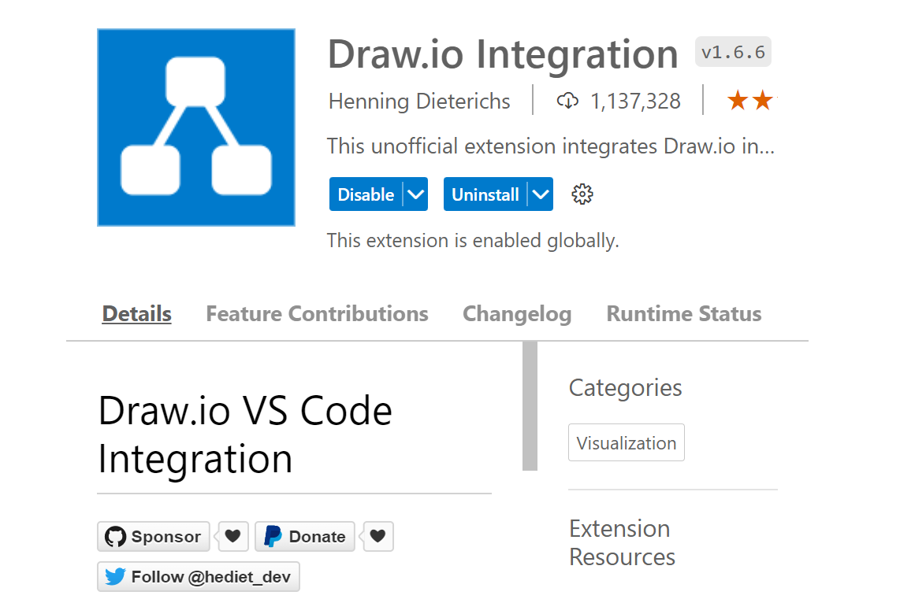

# Azure Networking: The Art of The Possible and the *why*

The purpose of this repo is to deliver **layered, reusable and github friendly** network architecture diagrams for Cloud Solutions Architects to run effective Azure design and skilling sessions. The repository will include tips and tools for effective story telling that explain the **why behind the design options based on requirements** and the art of the possible.  The design areas include - Azure Networking, Hybrid connectivity architectures, routing, firewalling, load balancing, multi-region, secure design, cross functional networking areas and AKS networking. The content is based on **real customer and partner design sessions** with collaboration from cross-functional architects.  The networking complexity is broken down into **layers** with **one diagram** per design area using [draw.io](https://app.diagrams.net/) now [diagrams.net](https://www.diagrams.net/). This repo will include configuration snippets to reduce the lab prep time and the need to leave the labs running for demos.

# Youtube Channel (The Art of the Possible Series)
### [Part-1 Playlist](https://www.youtube.com/channel/UC5x8jb_AMMAqMuFcMfX8RcA) - Core Networking Series
### [Part-2 Playlist](https://www.youtube.com/channel/UC5x8jb_AMMAqMuFcMfX8RcA) - Cross Functional Networking Series

# Scope: Reusable and Layered Network Diagrams

**Target Audience**:  Cloud Solution Architects, Network Architects, Cloud Infrastructure Architects, Solution Engineers

**Scope**
- Build Reusable and github friendly network architecture diagram templates
- Layered diagrams to run effective Azure Design and skilling sessions 
- Real world use cases dervied from working with Microsoft customers
- Level 100 to level 400 scenarios in one diagram
- Understand the why behind the design decision
- Minimize lab time
- Growth mindset

# Three Part Series

**[Part 1](#Part-1)** (**Core Networking**)Hub-Spoke Design,ARS, Azure Virtual WAN, Load Balancing, DNS in Azure, NVA HA and Private Endpoint)

**Upcoming Sessions**

**[Part 2](#Part-2)** (**Networking in Cross Functional Solution Areas**) (Azure AI Studio, AVS, AKS, Azure Data Factory, APIM, AppServices)

**Part 3** (Advanced Networking and Security) (IPv6, AzFW, DDoS, ExpressRoute Designs, AVD)

# Part 2
### Cross Functional Networking -  Upcoming live sessions

1. Azure AI Studio Networking  (Webinar Registration Link here)
2. AVS Networking (Webinar Registration Link here)
3. AKS Networking  (Webinar Registration link here)
4. ADF and SQL MI Networking
5. APIM Networking
6. Azure Container Apps, Web Apps Networking

# Part 1
### Core Networking - recording links available

| Sesssion Name                                         | Date  /Previous Recordings                      | Guest Speaker(s)  | Notes
|-------------------------------------------------------|------------------------------|------------------------------------------------|---------------------|
| [Session-1: Azure Hub-Spoke Design](#azure-hub-spoke-design)     | Thu, Feb 23rd 2023 12-1pm ET [Session-1 Recording](https://teams.microsoft.com/l/meetup-join/19%3ameeting_ZTI3MzMxNjAtZTg1Zi00NzhmLTg5ZTAtODExMjI5NmIyNjhi%40thread.v2/0?context=%7B%22Tid%22%3A%2272f988bf-86f1-41af-91ab-2d7cd011db47%22%2C%22Oid%22%3A%22a1a1b5e6-a149-4bcb-ba81-9fbea3a44230%22%2C%22IsBroadcastMeeting%22%3Atrue%2C%22role%22%3A%22a%22%7D&btype=a&role=a)| Tommy Falgout (Sr. Cloud Solution Architect), Jose Moreno (Principal Customer Engineer), Heather Sze (Global Black Belt, Networking)   |  [Agenda and FAQ](Agenda/session1.md) [Feedback form](https://forms.office.com/r/mZ418DCScx) |
| [Session-2:  vWAN - Azure Virtual WAN](#vwan-azure-virtual-wan)  | Thu, Mar 2nd 2023 12-1pm ET [Session-2 Recording](https://teams.microsoft.com/l/meetup-join/19%3ameeting_ZTJlNmJlNzYtZDU1NC00OGU1LTllODEtYjE4NjhmZGY5MTAz%40thread.v2/0?context=%7B%22Tid%22%3A%2272f988bf-86f1-41af-91ab-2d7cd011db47%22%2C%22Oid%22%3A%22a1a1b5e6-a149-4bcb-ba81-9fbea3a44230%22%2C%22IsBroadcastMeeting%22%3Atrue%2C%22role%22%3A%22a%22%7D&btype=a&role=a) | Mays Algebary (Global Black Belt, Networking), John Guo (Cloud Solution Architect, Check Point) |  [Agenda and FAQ](Agenda/session2.md) [Feedback Form](https://forms.microsoft.com/r/htdTjn6QT1) |
| [Session-3:  Load balancing in Azure](#load-balancing-in-azure)   | Thu, Mar 9th 2023 12-1pm ET [Session-3 Recording](https://teams.microsoft.com/l/meetup-join/19%3ameeting_M2U0ZDMzMjUtMjdmMS00MzViLTk4ZjMtYjU2Y2ExZDgzZDE4%40thread.v2/0?context=%7B%22Tid%22%3A%2272f988bf-86f1-41af-91ab-2d7cd011db47%22%2C%22Oid%22%3A%22a1a1b5e6-a149-4bcb-ba81-9fbea3a44230%22%2C%22IsBroadcastMeeting%22%3Atrue%2C%22role%22%3A%22a%22%7D&btype=a&role=a)  | Marc De Droog (Global Black Belt, Networking), John Guo(Cloud Solution Architect, Check Point) |  [Agenda and FAQ](Agenda/session3.md) [Feedback Form](https://forms.microsoft.com/r/HNhm2a7ghu)|
| [Session-4: DNS Options in Azure](#dns-in-azure)                 | Thu, Mar 16th 2023 12-1pm ET [Session-4 Recording](https://teams.microsoft.com/l/meetup-join/19%3ameeting_ZjdiNzA1YzItMjY3Mi00NmNkLTg2OWMtZDVmZmNlNWYwMDgz%40thread.v2/0?context=%7B%22Tid%22%3A%2272f988bf-86f1-41af-91ab-2d7cd011db47%22%2C%22Oid%22%3A%22a1a1b5e6-a149-4bcb-ba81-9fbea3a44230%22%2C%22IsBroadcastMeeting%22%3Atrue%2C%22role%22%3A%22a%22%7D&btype=a&role=a) | Daniel Mauser (Global Black Belt, Networking)  |  [Agenda and FAQ](Agenda/session4.md) [Feedback Form](https://forms.microsoft.com/r/9HSZnXTPSQ) |
| [Session-5: NVA high availabilty options](#nva-high-availability)| Thu, Mar 23rd 2023 12-1pm ET [Session-5 Recording](https://teams.microsoft.com/l/meetup-join/19%3ameeting_MTIyNjY5NjgtZTFlYi00NzY2LWJkMjctZjU4ODA2OWUxMjI3%40thread.v2/0?context=%7B%22Tid%22%3A%2272f988bf-86f1-41af-91ab-2d7cd011db47%22%2C%22Oid%22%3A%22a1a1b5e6-a149-4bcb-ba81-9fbea3a44230%22%2C%22IsBroadcastMeeting%22%3Atrue%2C%22role%22%3A%22a%22%7D&btype=a&role=a) | Jose Moreno (Principal Customer Engineer)      |  [Agenda and FAQ](Agenda/session5.md) [Feedback Form](https://forms.microsoft.com/r/cJ55nC20KM)|
| [Session-6: Private Endpoints](#private-endpoints)               | Thu, Mar 30th,2023 12-1pm ET [Recording link](https://teams.microsoft.com/l/meetup-join/19%3ameeting_OTQ1MmE1ZGQtY2EzYS00ZDJlLTgzZmItNWI0MTk3MGE2ZGU1%40thread.v2/0?context=%7B%22Tid%22%3A%2272f988bf-86f1-41af-91ab-2d7cd011db47%22%2C%22Oid%22%3A%22a1a1b5e6-a149-4bcb-ba81-9fbea3a44230%22%2C%22IsBroadcastMeeting%22%3Atrue%2C%22role%22%3A%22a%22%7D&btype=a&role=a) | Daniel Mauser (Global Black Belt, Networking)  Shruthi Vijaya Nair (Global Black Belt, Networking)|  [Agenda and FAQ](Agenda/session6.md) [Feedback Form](https://forms.microsoft.com/r/THgJBiZHcR) |

# Design Areas (Core Networking Part 1)
## Azure Hub-Spoke Design

Download [draw.io diagram](diagrams/hub-spoke.drawio). More information on how to open .drawio files [here](#installation).

In this session we walk through the Hub-spoke architecure design. This design includes the following layers.

- Hybrid Connectivity Architecture with hub-spoke design
- Site-to-site, Point-to-Site and ExR connected Branches
- Default traffic Flows
- Variation of the default design based on requirements
- Use case for AzFw  
- Use case for ARS (Azure Route server)
- Use case for NVA (Pros and Cons)
- VPN Gateway Active Active design challange
- Multi-region design
- Configuration snippets
- Concepts
- Limitations

## vWAN (Azure Virtual WAN)

Download [draw.io diagram](diagrams/vwan.drawio). More information on how to open .drawio files [here](#installation).

In this session we walk through the vWAN architectures. This design includes the following layers:
 - Hybrid Connectivity Architecture
 - Single region default flows with Azure vWAN
 - Multi region default flows with Azure vWAN
 - Secured vWAN
 - BGP Endpoint feature use case
 - Use case for routing intent
 - Use case for NVA in indirect spokes
 - Use case for Custom Routing
 - Multiregion with ExR Boe-tie design

## Load balancing in Azure

Download [draw.io diagram](diagrams/load-balancing.drawio). More information on how to open .drawio files [here](#installation).

In this session we walk through the load balancing architectures. This design includes the following layers
 - Azure load balancer (layer 4)
 - Azure application Gateway (layer 7)
 - Cross Region Load Balancer
 - Azure Traffic Manager (Global)
 - Azure Front door (AFD)
 - Azure Gateway Load Balancer
 - Multi-region design
 - Use case for Private endpoint with AFD

## DNS in Azure

Download [draw.io diagram](diagrams/dns-in-azure.drawio). More information on how to open .drawio files [here](#installation).

In this session we walk through the DNS options in Azure.his design includes the following layers

- DNS Options in Azure
- Default DNS configuration 
- Custom DNS
- Hybrid DNS
- Private DNS Zones
- Azure Private DNS Resolver

## NVA High availability

Download [draw.io diagram](diagrams/NVA-ha.drawio). More information on how to open .drawio files [here](#installation).

This design includes the following layers:
- NVA LB Sandwich design
- Challenge: Preserving flow symettry
- North South flows
- East West Flows
- Packet Captures
- Use case Floating IP
- Use case for HA Ports
- Configuration Snippets

## Private Endpoints

Download [draw.io diagram](diagrams/private-EP.drawio). More information on how to open .drawio files [here](#installation).

This design includes the following layers:
- Service Endpoint
- Private Endpoint
- Private Link Service
- VNET Integration vs Private Endpoint
- Use case with Azure Front Door (AFD) with Private Endpoint
- Use case with AKS

# Design Areas (Cross Functional - Part 2)
## Azure AI Studio - Network design

- AI Studio Prompt flow with Managed VNET and Private endpoints
- Short Demo with AI Studio Playground
- Azure AI Studio Architecture Components (PaaS and IaaS)
- Key Concepts (Private Endpoints, Webapp, Embedding and Vector Database, Managed EP, AI Models and Prompt flow)
- Traffic flows with managed VNET with Private Endpoints

## Azure VMWare Solutions - Network design

- On-Prem Connectivity Using Global Reach
- VPN ER Transit using ARS
- NVA in Azure VNET (with ARS)
- Transite VNET design with NVA in Azure NVET (with ARS)
- NVA in AVS
- Secured vWAN HUB Design with Routing Intent

## Networking in Azure Kubernetes Service (AKS)

This design includes the following layers

- Azure CNI
- Azure Kubenet
- Azure CNI Overlay
- IPv6 in AKS
- Azure Data platform integration (Example: SQL MI integration, SQL DB, Cosmos DB, OSS DB (mysql, postgreSQL), blob storage)
- Multi-region with Relational DB(SQLMI, SQL DB, OSS DB) (Single Master) (Shopping cart)
- Multi-region with Non-relational or NoSQL (Cosmos DB, MongoDB) (Multi Master) (catalog db)

## Networking with Azure Data Factory
This design includes the following layers
- Azure ADF  (Data movement and orchestration)
- Azure Synapse
- Azure Datalake or blob storage
- SQL MI (source and destination)
- Third Party Cloud (GCP)
- Hybrid SQL Server On-premise
- Cosmos DB, SQL DB (source and destination)
- OSS Databases (postgreSQL, mysql, mariadb)

## Azure API Management (APIM)
- APIM Big Picture view
- Default mode
- External network mode
- Internal network mode
- Internal network mode with Azure Application Gateway
- Internal network mode with AKS Backend API
- APIM with Azure firewall/NVA
- APIM Identity - AAD and B2C Integration
- APIM Multi-region Architecture
- Self hosted gateway
- LetsEncrypt Certificates and APIM Custom Domain
- Azure Private DNS Zones integration
- Network Troubleshooting

## Azure Container Apps and App Service Networking

- Private Endpoint Integration
- Service Endpoint
- VNET Integration
- NAT Gateway Integration
- Azure Private DNS Zone Planning

# Design Areas (Part 3 - Future)

- Azure Virtual Desktop - Network design
- IPv6 in Azure
- AzFW deep dive
- ExpressRoute designs

# Tooling - Draw.io (now diagrams.net)
## Features

Draw.io is [feature rich](https://www.diagrams.net/blog). I've listed my top 10 favorite features that are useful for drawing network architecture diagrams

1. [Add Shapes](https://www.diagrams.net/blog/azure-diagrams): View -> Shapes -> Add Shapes -> Azure. 
2. [Add Layers](https://www.diagrams.net/blog/interactive-diagram-layers): View -> Layers. Create layers and show hide layers.
3. [Add Scratchpad](https://www.diagrams.net/blog/azure-diagrams): View -> Scratchpad
4. View Outline: View -> Outline
5. Flow animation: Select Flow -> Flow animation
6. [Sketch Style](https://www.diagrams.net/blog/rough-style) (hand drawn style)
7. [Whiteboard](https://www.diagrams.net/blog/change-editor-mode):  Extras-> Theme-> Sketch
8. [Curved lines](https://drawio-app.com/curved-connectors-in-draw-io-diagrams/) for flows
9. [vscode integration](https://marketplace.visualstudio.com/items?itemName=hediet.vscode-drawio)
10. [Group shapes](https://drawio-app.com/more-draw-io-shortcuts-to-streamline-your-diagramming/) using CTRL-G

## Installation

There are three options to open the draw.io diagrams.

1. Use the desktop app
    Download the desktop app from the microsoft store. 
    

    Dowload drawio file from github and open in the desktop app. File -> Raw -> Save link as.
    
    
2. Use the web browser to open the file online using the link [here](https://app.diagrams.net/)

3. Integrate with vscode using the 

## Acknowledgement

Special thank you to my colleagues

- [David O'Keefe](https://www.linkedin.com/in/david-o-keefe/)
- [Shaun Croucher](https://github.com/shcrouch)
- [Xavier Elizondo](https://github.com/xelizondo)
- [Heather Tze](https://github.com/hsze)
- [Mays Algebary](https://github.com/malgebary)
- [Daniel Mauser](https://github.com/dmauser)
- Shruthi Nair
- [Jose Moreno](https://github.com/erjosito)
- [Sowmyan Soman Chullikkattil](https://github.com/sowsan)
- [Mike Richter](https://github.com/michaelsrichter)
- [Mike Shelton](https://www.linkedin.com/in/mshelt)
- [Tommy Falgout](https://github.com/lastcoolnameleft)
- [Amanda Wong](https://github.com/wongamanda)
- Israel Ekpo
